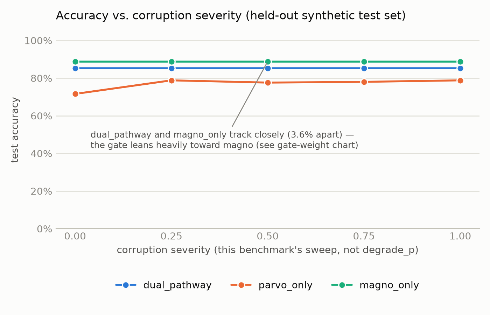
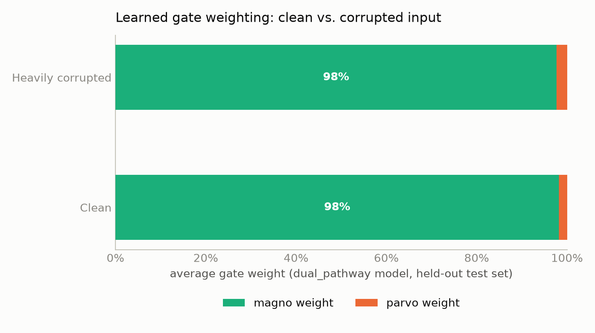
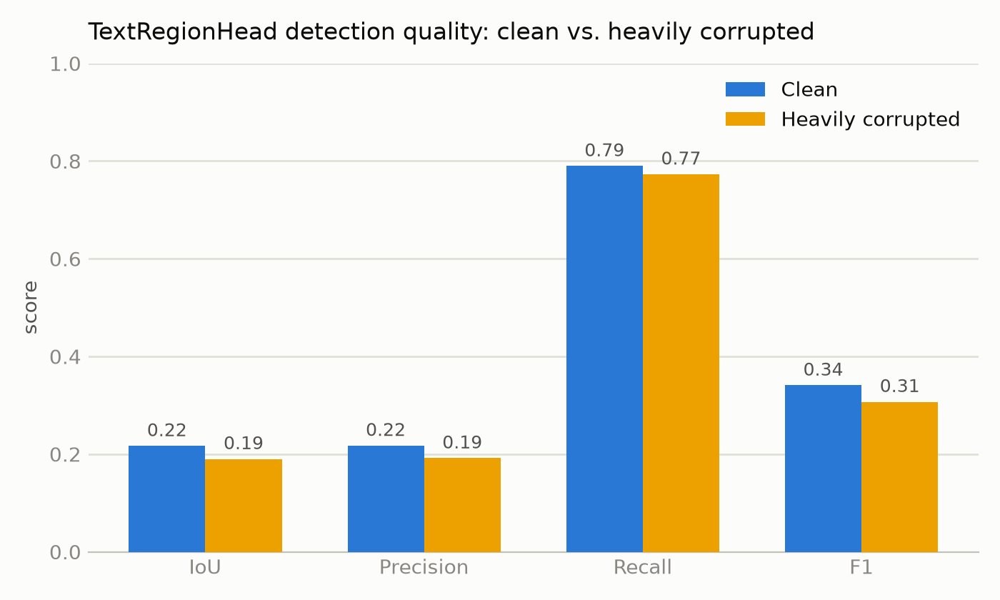
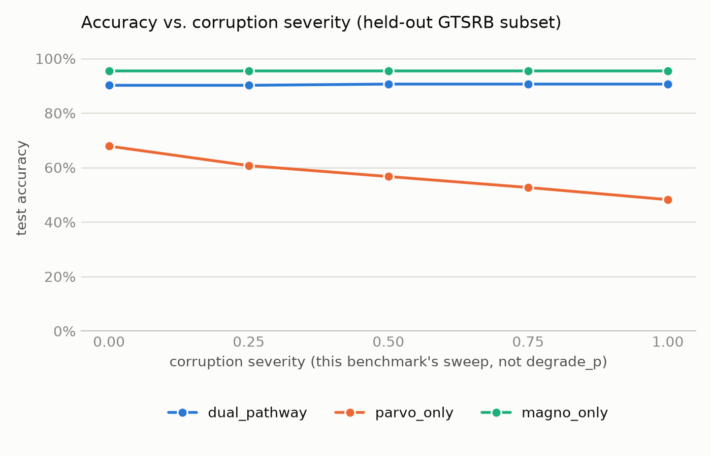
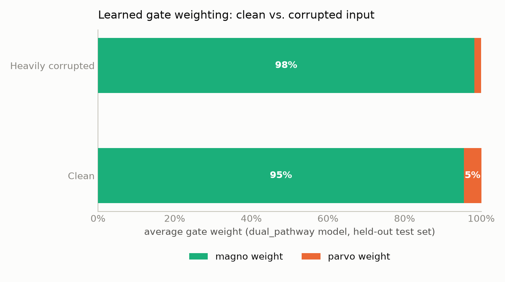
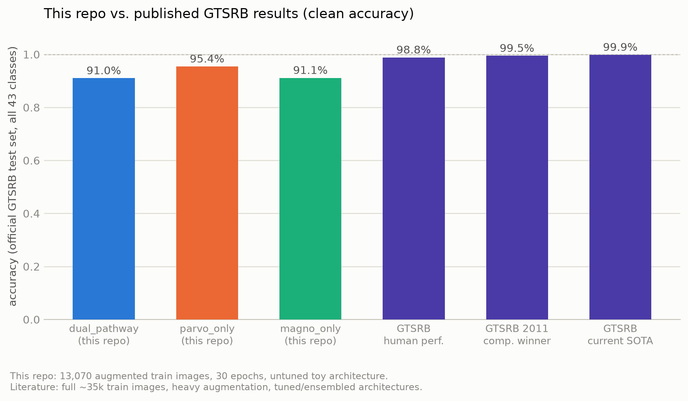

# Dual-Pathway Visual Classifier

A visual classifier inspired by the magnocellular / parvocellular split in
primate vision — one fast, coarse, low-fidelity pathway and one slow,
detailed, high-fidelity pathway, fused by a learned gate. Built with signs
and text-in-the-wild in mind: conditions where lighting, blur, or distance
can wreck fine detail but coarse shape still gets through.

## Why two pathways

| | Magno pathway | Parvo pathway |
|---|---|---|
| Input | grayscale, downsampled | full color, full resolution |
| Depth | shallow, wide receptive field | deeper, fine-grained filters |
| Speed | fast | slower |
| Good at | coarse shape/contrast, robust to noise & blur | fine detail, reading text, color cues |
| Analogous to | motion/contrast-sensitive magnocellular cells | detail/color-sensitive parvocellular cells |

Rather than picking one input representation and hoping it generalizes, the
model always sees both and learns *when to trust which one*.

## Architecture

```
gray_lowres ──▶ MagnoStream ──┐
                               ├──▶ GatedFusion ──▶ classifier ──▶ logits
color_highres ─▶ ParvoStream ─┘
                     │
                     └─▶ TextRegionHead ──▶ text mask ──▶ OCR
```

- **`MagnoStream`** — grayscale in, large strides, small feature dim. Cheap and fast.
- **`ParvoStream`** — color in, deeper conv stack. Exposes its pre-pool spatial
  feature map (`forward_spatial`) for the text head to use.
- **`GatedFusion`** — a small network looks at both feature vectors and predicts
  a per-sample weighting between them, rather than a fixed concat. Log these
  weights at inference time to see which pathway the model is actually relying
  on for a given input.
- **`TextRegionHead`** — parvo-only (magno's resolution can't resolve
  characters). Predicts a per-pixel text/sign-likelihood mask, which
  `text_regions_from_mask` turns into bounding boxes.
- **OCR (`ocr_read_regions`, `detect_and_read_text`)** — crops each detected
  region and reads it with `pytesseract` or `easyocr`. This is the only part
  that reads characters; the network itself only detects *where* text is.

## Training strategy

Two things keep the model honest:

1. **Random pathway degradation** (`make_dual_inputs(..., degrade_p=...)`) —
   simulates bad conditions by blurring/adding noise to the color stream for
   a fraction of samples, so magno has to carry those cases.
2. **Pathway dropout** (`train_one_epoch(..., pathway_dropout_p=...)`) —
   randomly zeroes out one entire pathway per batch, so the classifier can't
   just learn to always lean on parvo and ignore magno (or vice versa).

Without both of these, the gate tends to collapse onto whichever pathway is
higher-fidelity on average and stops learning to use the other one when it
actually needs to.

## Quickstart

```python
import torch
from dual_pathway_classifier import DualPathwayClassifier, make_dual_inputs, detect_and_read_text

model = DualPathwayClassifier(num_classes=10)

# from a single full-res color image tensor (3, H, W) in [0, 1]
gray, color = make_dual_inputs(my_image)
gray, color = gray.unsqueeze(0), color.unsqueeze(0)  # add batch dim

logits, gate_weights = model(gray, color, return_gate=True)

# classify + find + read text regions in one call
logits, gate_weights, texts = detect_and_read_text(model, gray, color, engine="tesseract")
```

Training loop:

```python
from torch.optim import Adam
from dual_pathway_classifier import train_one_epoch

optimizer = Adam(model.parameters(), lr=1e-3)
# dataloader yields (color_img_batch, label_batch, text_mask_batch_or_None)
loss = train_one_epoch(model, dataloader, optimizer, device="cpu")
```

## Requirements

- `torch`
- `scipy` (optional — enables proper multi-region connected-component
  detection in `text_regions_from_mask`; falls back to a single bounding box
  over all activated pixels without it)
- `pytesseract` + the `tesseract-ocr` system binary, **or** `easyocr`
  (optional — only needed for `ocr_read_regions` / `detect_and_read_text`)
- `typesafe-sdk` (optional — only needed for `jev_decision.py`)

```bash
pip install torch scipy
pip install pytesseract        # + apt install tesseract-ocr (or your OS equivalent)
# or
pip install easyocr
pip install typesafe-sdk       # optional, for the Jev decision layer
```

## Evaluation

`evaluate.py` is built around the fact that this architecture's whole point
is graceful degradation — so the metrics compare **across degradation
levels and against simpler baselines**, not just one clean-condition number.

**Ablation baselines** — `ParvoOnlyClassifier` and `MagnoOnlyClassifier`
drop into the same eval loop as the dual model, so you can directly check
whether fusion is earning its complexity over "just a normal color CNN" or
"just a lightweight grayscale CNN."

**Degradation curves**, not single numbers:

```python
from evaluate import compare_models, print_comparison_table

results = compare_models(
    {"dual_pathway": dual_model, "parvo_only": parvo_baseline, "magno_only": magno_baseline},
    test_loader, device, degrade_levels=(0.0, 0.25, 0.5, 0.75, 1.0),
)
print_comparison_table(results)
```

The shape of the curve is the point: `parvo_only` should fall off sharply as
`degrade_p` rises, `magno_only` should stay flat but low overall, and
`dual_pathway` should stay both high and flat if the gate is doing its job.

**Text detection** — pixel-level IoU/precision/recall/F1 for the region
head against ground-truth masks (`text_detection_metrics`).

**OCR: this pipeline vs. straight OCR on the raw image** — the specific
comparison worth running: does localizing before OCR actually help?

```python
from evaluate import evaluate_ocr_pipeline

# samples: list of (color_img_tensor, ground_truth_text) pairs
results = evaluate_ocr_pipeline(model, samples, engine="tesseract", degrade_p=0.5)
# {"raw_ocr": {"cer": ..., "wer": ...}, "detect_then_ocr": {"cer": ..., "wer": ...}}
```

Character/word error rate (CER/WER) are the standard OCR metrics — lower is
better, 0 is a perfect transcription. Expect `raw_ocr` and `detect_then_ocr`
to be close on clean, uncluttered images and to diverge as `degrade_p` rises
or background clutter increases — that gap is what localization buys you.
Run it at a few `degrade_p` values rather than just one to see the trend.

### Public benchmarks worth testing against

For a more rigorous comparison than your own held-out set:

- **[GTSRB](https://benchmark.ini.rub.de/gtsrb_news.html)** (German Traffic
  Sign Recognition Benchmark) — classification, has real varied lighting/blur.
- **[ICDAR 2015](https://rrc.cvc.uab.es/?ch=4)** / **COCO-Text** — scene text
  detection, standard for evaluating region proposals like `TextRegionHead`.
- **[SVHN](http://ufldl.stanford.edu/housenumbers/)** — house-number digits
  in natural scenes, a reasonable proxy for "read small text in the wild."
- Off-the-shelf detectors like **EAST** or **CRAFT** are the standard
  comparison points for text localization specifically, if you want to
  benchmark `TextRegionHead` against dedicated text-detection models rather
  than just against raw-OCR.


- Not a full OCR engine — `TextRegionHead` finds *where* text is, it doesn't
  read it. Reading is delegated to `pytesseract`/`easyocr`.
- Not pretrained — this is architecture + training scaffolding. You'll need
  your own labeled dataset (images, class labels, and optionally text-region
  masks) to train it.
- Box extraction without `scipy` is a coarse single-box fallback — fine for
  one sign in frame, not for scenes with multiple separated text regions.

## Results (synthetic benchmark)

There's no real labeled dataset in this repo (see caveats above), so these
charts come from `benchmark.py`: a small procedural "signs" dataset (stop /
yield / speed-limit-25 / speed-limit-45 / warning, rendered with PIL, each
with a ground-truth text mask), with `DualPathwayClassifier` and both
ablation baselines trained briefly against a random corruption-severity
sweep. `plot_results.py` renders the charts below from its output. Treat
this as a demonstration of the mechanics, not a claim about real-world
sign/text accuracy — this is still "not pretrained" scaffolding, just like
the rest of the repo.

Two of the five classes (`speed_limit_25`, `speed_limit_45`) share
identical shape and color and differ *only* by their digits, specifically
so there's a case a shape-only view structurally can't resolve — the case
fusion is supposed to help with.

**Accuracy vs. corruption severity:**



`parvo_only` degrades as corruption increases, as expected — full-color,
full-resolution input degrading is exactly what should hurt a
detail-dependent classifier. `magno_only` is flat by construction (its
input is always derived from the pre-corruption image), but notably *not*
low: at this resolution it still picks up a coarse ink-density signal for
the digit pair rather than being fully blind to it, so its flat baseline
sits above `parvo_only` at every severity level, clean included.

**Learned gate weighting:**



This is the honest result, not the idealized one: the gate collapsed onto
magno almost entirely (~98/2) at *both* clean and heavily-corrupted input —
it didn't learn to shift with severity. Given `magno_only` outperformed
`parvo_only` even on clean input in this run, collapsing onto the stronger
average pathway is the locally rational thing for the gate to learn; it's
also a direct, concrete instance of the exact failure mode the
[Training strategy](#training-strategy) section above warns about, despite
this run using both random pathway degradation *and* pathway dropout. If
you're training this for real, log gate weights like this on your own
validation set rather than assuming the mechanism worked.

**Text region detection quality:**



High recall, low precision — the trained head reliably finds *a* region
containing text but over-predicts its extent (expected from a handful of
epochs on ~750 toy images); both metrics dip modestly under heavy
corruption.

Reproduce with:

```bash
pip install pillow matplotlib  # in addition to torch, scipy
python benchmark.py    # trains the three models, writes benchmark_results.json
python plot_results.py # renders assets/*.png from that json
```

## Results (real data: GTSRB subset)

Same setup, real photographs this time — a 10-class subset of
[GTSRB](https://benchmark.ini.rub.de/gtsrb_news.html) (German Traffic Sign
Recognition Benchmark): four speed-limit signs that share shape/color and
differ only by digits (`speed_30`/`50`/`60`/`70` — the real-world version
of the synthetic pair above), plus six shape-distinct classes (`stop`,
`yield`, `priority_road`, `no_entry`, `general_caution`, `keep_right`).
Split by GTSRB "track" (each physical sign is a ~30-frame burst; a random
per-image split would leak near-duplicates between train/test), 928 train /
224 test images total. See `benchmark_gtsrb.py` for the exact setup —
GTSRB itself isn't in this repo (~270MB), so this one isn't runnable
without downloading it first (instructions in the script's docstring).

**Accuracy vs. corruption severity:**



This is the cleaner result of the two: `parvo_only` shows a real, steady
decline as corruption rises (67.9% → 48.2%), `magno_only` stays flat and
strong (95.5%, structurally unaffected — same reason as above), and
`dual_pathway` (90.2–90.6%) sits close to but consistently below
`magno_only` rather than exactly matching it.

**Learned gate weighting:**



Still leans heavily on magno, but this time it's not a total freeze: parvo's
share drops from 5% clean to 2% corrupted — a real, if modest, shift in the
expected direction, unlike the synthetic run above. `dual_pathway` scoring
slightly *below* `magno_only` despite the gate mostly favoring magno is the
other honest wrinkle here: a small, partially-trusted contribution from a
noisier pathway can net out to a slight loss rather than a gain — fusion
isn't free, and this is what it looks like when the gate hasn't converged
to something better than "mostly ignore the worse pathway."

Reproduce with (after downloading GTSRB — see `benchmark_gtsrb.py`):

```bash
python benchmark_gtsrb.py  # trains the three models, writes gtsrb_results.json
python plot_gtsrb.py       # renders assets/gtsrb_*.png from that json
```

### How this compares to published GTSRB results

The two results above train under this repo's own corruption-severity
sweep, which isn't the standard benchmark protocol and isn't a fair
comparison point against the literature. `benchmark_gtsrb_full.py` is the
apples-to-apples version: all 43 classes, evaluated for clean accuracy only
(no corruption) on the **official** 12,630-image GTSRB test set — the same
number the literature reports.



Published reference points: human performance 98.84%, the original IJCNN
2011 competition's winning entry 99.46%, current published SOTA 99.85%
([paperswithcode.com/sota/traffic-sign-recognition-on-gtsrb](https://paperswithcode.com/sota/traffic-sign-recognition-on-gtsrb),
[Stallkamp et al., IJCNN 2011](https://www.ini.rub.de/upload/file/1470692848_f03494010c16c36bab9e/StallkampEtAl_GTSRB_IJCNN2011.pdf)).
This repo lands at 91.0–95.4% (13,070 near-uncapped, augmented training
images — autocontrast, rotation, scale, translation, brightness/contrast
jitter — 30 epochs, an LR schedule, weight decay, and a pathway-dropout
rate that decays from 0.15 to 0.02 over training). Still a real gap from
the literature's ~35k images and heavy augmentation on tuned/ensembled
architectures, but a big jump from the first pass — this was never
intended to be competitive with SOTA, it's a lightweight scaffold for the
dual-pathway/gating *mechanism*, not an accuracy-optimized traffic-sign
classifier, but it's worth stating the gap plainly rather than only
showing the corruption curves in isolation.

`parvo_only` (95.4%) is consistently the strongest of the three on clean
data here, ahead of `magno_only` (91.1%) and `dual_pathway` (91.0%):
fusion's advantage in this repo is under degraded conditions (see the two
sections above), not a free win on clean accuracy. Adding weight decay in
this pass moved `parvo_only` and `magno_only` up slightly but
`dual_pathway` down slightly (it briefly edged out `magno_only` in an
earlier pass without weight decay, by 91.3% to 91.0% — a small enough
margin either way that it's more "roughly tied" than a stable ordering).
Small, mixed effects like this are the actual texture of tuning a real
model — reported as observed rather than smoothed into a cleaner-sounding
story.

Reproduce with (needs the official GTSRB test set too — see the script's
docstring):

```bash
python benchmark_gtsrb_full.py  # trains on all 43 classes, writes gtsrb_full_results.json
python plot_gtsrb_full.py       # renders assets/gtsrb_full_comparison.png
```

## Decision layer (optional): Jev

The model's raw outputs aren't decisions: logits aren't calibrated
probabilities, gate weights don't say whether to trust the call, and OCR
text comes with no confidence signal at all. `jev_decision.py` packs those
three signals (predicted class + confidence, magno/parvo gate weighting,
OCR text) into a single call to [Jev](https://typesafe.ai) — TypeSafe AI's
System One model — and gets back one calibrated, type-safe decision:
whether the classification is trustworthy, whether the OCR reading is
trustworthy, and what downstream automation should actually do
(`act` / `flag_for_review` / `discard`).

```python
from jev_decision import detect_read_and_decide

class_names = ["stop", "yield", "speed_limit", ...]
logits, gate_weights, texts, jev_decisions = detect_read_and_decide(
    model, gray, color, class_names, engine="tesseract",
)
for d in jev_decisions:
    print(d.answers["action"].choice, d.answers["trust_classification"].noul)
```

Requires `pip install typesafe-sdk` and a `TYPESAFE_API_KEY` environment
variable. This is entirely optional — everything else in this repo works
without it; it just turns raw model output into something a pipeline can
act on directly instead of hand-rolling threshold logic on logits.

## File overview

| File | Contents |
|---|---|
| `dual_pathway_classifier.py` | Full model, fusion, text head, OCR integration, training loop |
| `evaluate.py` | Baselines, degradation-curve metrics, text-detection metrics, OCR comparison |
| `jev_decision.py` | Optional: turns model output into a calibrated action decision via Jev |
| `benchmark.py` | Synthetic dataset + training run behind the Results section, reproducible |
| `plot_results.py` | Renders `assets/*.png` from `benchmark.py`'s output |
| `benchmark_gtsrb.py` | Same as `benchmark.py`, on a real GTSRB subset (needs a separate download) |
| `plot_gtsrb.py` | Renders `assets/gtsrb_*.png` from `benchmark_gtsrb.py`'s output |
| `benchmark_gtsrb_full.py` | Full 43-class GTSRB, official test set, clean accuracy vs. published results |
| `plot_gtsrb_full.py` | Renders `assets/gtsrb_full_comparison.png` from `benchmark_gtsrb_full.py`'s output |
